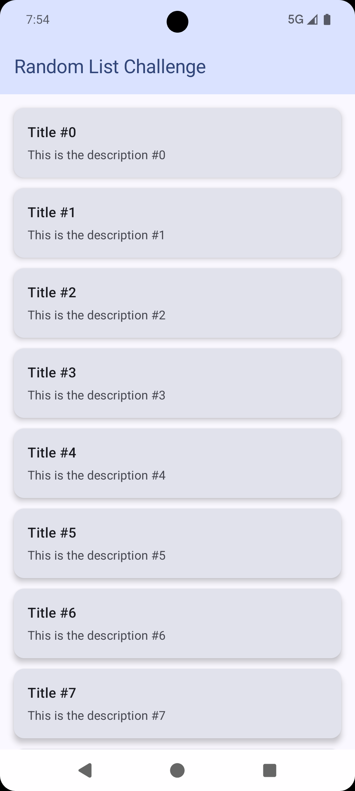
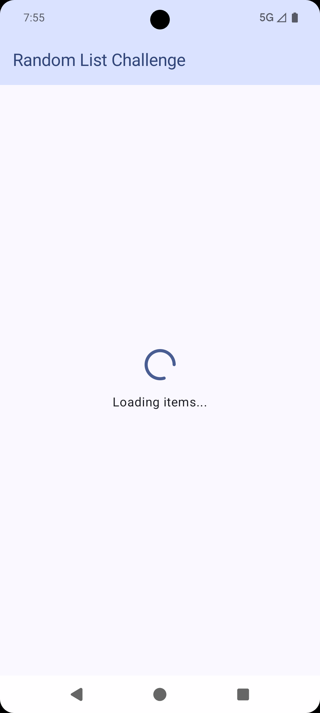
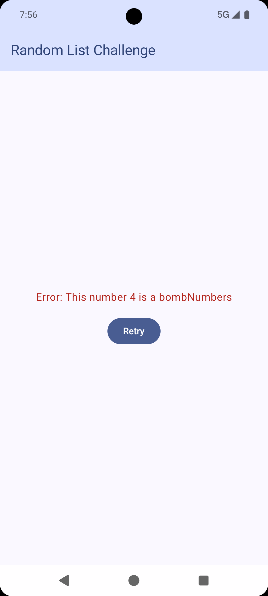

# Android Compose Challenge

This project is a modern Android application built using Jetpack Compose, designed to demonstrate the separation of concerns, robust state management, and comprehensive testing strategies. 

- **Dynamic List Handling**: Displays a list of items fetched from a data layer.
- **Error Handling & Retry Mechanism**: Simulates an error to show an Error UI state and permits users to recover via a Retry action.

## Tech Stack & Architecture

### **UI & Presentation (`com.events.challenge.presentation`)**
*   **Jetpack Compose**: Used exclusively for UI rendering.
*   **MVI Pattern (Model-View-Intent)**: The UI state is strictly managed using a unified `ItemUiState` (Loading, Success, Error). User interactions are sent using `ItemAction`, and one-off events (like Toast messages) are emitted via `ItemSideEffect`.
*   **State Hoisting**: The UI components (`ItemView`, `ErrorView`, `MainContentView`) are stateless and purely depend on standard data structures or callback lambda arguments, allowing for isolated testing.

### **Domain (`com.events.challenge.domain`)**
*   **Clean Architecture**: The business logic is isolated.
*   **Use Cases**: `GetItemsUseCase` connects the data layer to the presentation layer without coupling them.

### **Data (`com.events.challenge.data`)**
*   **Repository Pattern**: `DefaultItemRepository` acts as the single source of truth to provide data via Kotlin `Flow<Result<List<ItemModel>>>`.

### **Core Libraries**
*   **Coroutines & Flow**: Used for asynchronous data fetching and UI state emission.
*   **Hilt**: Handles Dependency Injection for ViewModels, UseCases, Repositories, and generalized interfaces (`StringProvider`).
*   **StringProvider**: A clean abstraction to fetch Android String Resources (`strings.xml`) without exposing the `Context` directly to business layers, preventing memory leaks and maintaining unit testability.

## Screenshots

| List View | Error State | Retry Action |
| :---: | :---: | :---: |
|  |  |  |